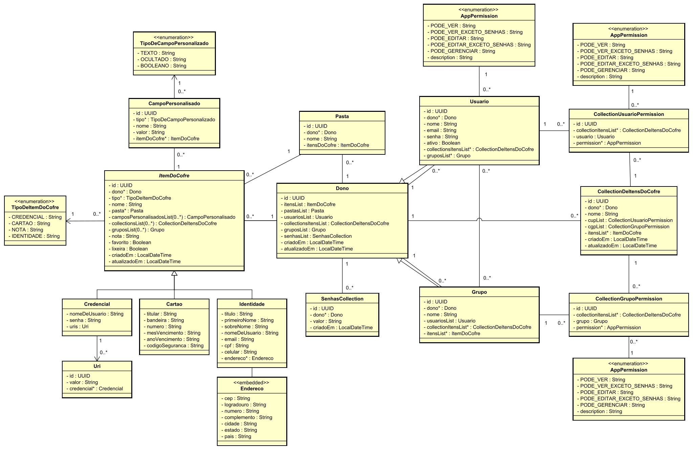
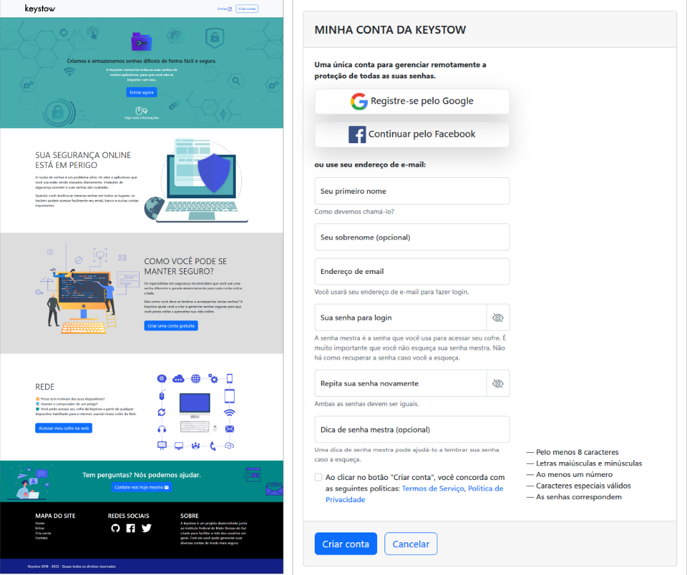
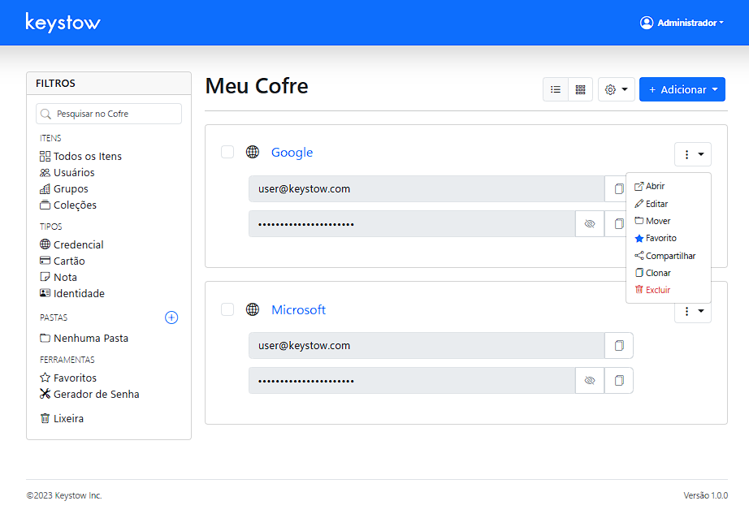
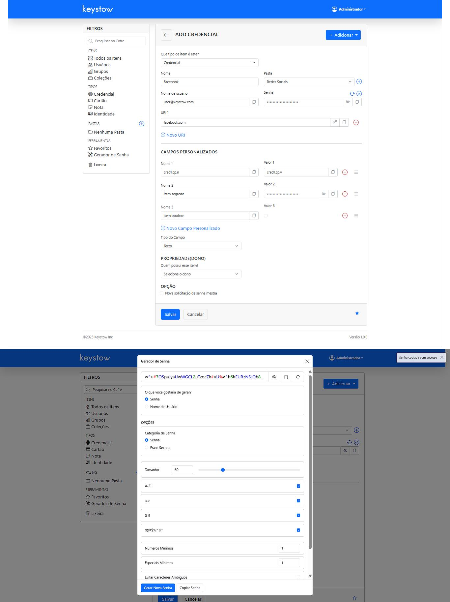

<p align="center">
  
</p>

Keystow é um protótipo MVP feito como trabalho de conclusão de curso. Ele é um sistema web colaborativo de gerenciamento de senhas projetado especificamente para atender às necessidades de PMEs (pequenas e médias empresas). Este projeto visa melhorar a gestão de senhas compartilhadas no ambiente de trabalho, focando no design e usabilidade.

## 📝 Características Principais

- Gerenciamento colaborativo
- Facilitar o compartilhamento de credenciais
- Melhorar a colaboração no local de trabalho
- Gerador de senhas integrado
- Eliminar a reutilização de senhas
- Controle de acesso

<details>
  <summary><strong>Diagrama de Classes</strong></summary>



</details>

<details>
  <summary><strong>Página inicial institucional e de registro</strong></summary>



</details>

<details>
  <summary><strong>Página home e principal do sistema</strong></summary>



</details>

<details>
  <summary><strong>Página de cadastro de item (Credencial) e modal de geração de senha</strong></summary>



</details>

## ❗Alerta de Segurança

**ATENÇÃO: Este projeto é um protótipo MVP (Minimum Viable Product) não completo e não deve ser utilizado em ambientes de produção sem modificações significativas.**

### Limitações de Segurança:

1. **Falta de Criptografia de Dados**: Atualmente, os dados armazenados no banco de dados não estão criptografados. Isso significa que as informações sensíveis, como senhas e outros dados confidenciais, estão vulneráveis se o banco de dados for comprometido.
2. **Protótipo em Desenvolvimento**: Como um MVP, este projeto foi desenvolvido para demonstrar funcionalidades e conceitos, portanto, não foi concluído, não use em ambientes reais de produção.
3. **Necessidade de Revisão de Segurança**: Antes de considerar o uso deste sistema em um ambiente real, é imperativo implementar medidas robustas de segurança, incluindo, mas não se limitando a:
   - Criptografia de dados em repouso no banco de dados
   - Criptografia de dados em trânsito
   - Auditoria de segurança abrangente

### Recomendações:

- Utilize este protótipo apenas para fins de demonstração e testes em ambientes de desenvolvimento.
- Não insira dados reais ou sensíveis no sistema em seu estado atual.
- Antes de qualquer implementação em produção, consulte especialistas em segurança da informação para uma revisão completa e implementação de medidas de segurança adequadas.

Contribuições e sugestões para aprimorar a segurança são bem-vindas e encorajadas.

## 💻 Tecnologias Utilizadas

- Java/Jakarta
- Spring Framework (Spring Boot, Spring Security, Spring Data JPA)
- Thymeleaf
- MySQL

## 📌 Pré-requisitos

- Java JDK 17 ou superior
- Maven
- MySQL instalado ou Docker (para o banco de dados MySQL)

## ⚙️ Instalação e Configuração

1. Clone o repositório:

   ```
   git clone <https://github.com/seu-usuario/keystow.git>
   cd keystow
   ```

2. Execute o arquivo `compose.yaml` ou configure o banco de dados MySQL usando Docker:

   ```
   docker run --name keystow-mysql -e DATABASE_ROOT_PASSWORD=sua_senha -e DATABASE_NAME=keystow_db_mysql -p 3306:3307 -d mysql:8.0.35
   ```

3. Configure as credenciais do banco de dados no arquivo `application.properties` recomenda-se usar um arquivo `.env`
4. Execute o projeto usando Maven:

   ```
   mvn spring-boot:run
   ```

5. Acesse o Keystow em `http://localhost:8081`.

## 🧑🏻‍💻 Uso

Após a instalação, você pode:

1. Registrar uma nova conta de usuário
2. Fazer login no sistema
3. Criar, visualizar, editar e excluir usuários, grupos, coleções e itens no cofre (credenciais, ~~cartões, notas, identidades~~)
4. Gerenciar usuários, grupos, coleções e itens no cofre
5. Compartilhar credenciais com outros membros da equipe
6. Utilizar o gerador de senhas para criar senhas fortes e aleatórias

## 🚀 Contribuição

Contribuições são bem-vindas. Abra um problema ou envie PRs.

## 📄 Licença

Este projeto está licenciado sob a [MIT License](https://opensource.org/license/MIT).

## 📨 Contato

Para mais informações, entre em contato com [[dainler.ms@gmail.com]](mailto:dainler.ms@gmail.com).
